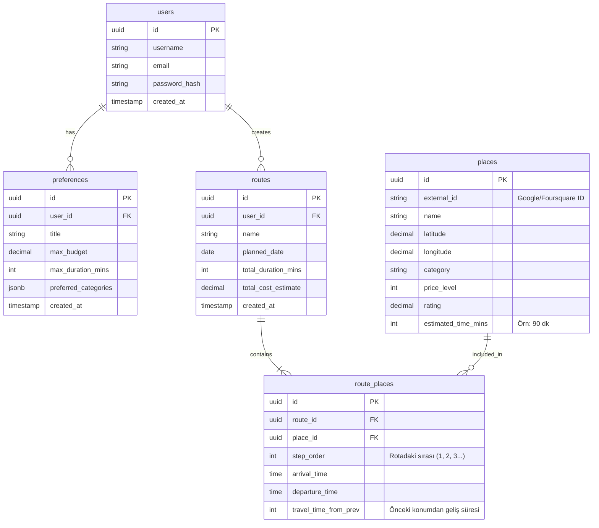

# TrackMate - PostgreSQL Veritabanı Şeması

Bu belge, TrackMate platformu için Kullanıcılar, Rotalar, Tercihler ve Mekanlar arasındaki ilişkiyi kuran temel veritabanı tasarımını içermektedir.

## Varlık İlişki (ER) Diyagramı

Aşağıdaki diyagramda tablolar arasındaki bire-çok ve çoka-çok ilişkiler özetlenmiştir.



## SQL Tablo Oluşturma Scriptleri (DDL)

PostgreSQL veritabanında bu şemayı ayağa kaldırmak için aşağıdaki `.sql` komutlarını kullanabilirsiniz. Tablolarda performans ve kimlik yönetimi için standart olarak `UUID` tipinde id'ler kullanılmıştır.

```sql
-- UUID eklentisini aktif edelim (Eğer veritabanında yoksa)
CREATE EXTENSION IF NOT EXISTS "uuid-ossp";

-- 1. KULLANICILAR (users) TABLOSU
CREATE TABLE users (
    id UUID PRIMARY KEY DEFAULT uuid_generate_v4(),
    username VARCHAR(50) UNIQUE NOT NULL,
    email VARCHAR(255) UNIQUE NOT NULL,
    password_hash VARCHAR(255) NOT NULL,
    created_at TIMESTAMP WITH TIME ZONE DEFAULT CURRENT_TIMESTAMP,
    updated_at TIMESTAMP WITH TIME ZONE DEFAULT CURRENT_TIMESTAMP
);

-- 2. KAYITLI TERCİHLER (preferences) TABLOSU
-- Kullanıcının NLP'de sık kullandığı profiller. (Örn: "Hafta sonu kafa dinleme")
CREATE TABLE preferences (
    id UUID PRIMARY KEY DEFAULT uuid_generate_v4(),
    user_id UUID NOT NULL REFERENCES users(id) ON DELETE CASCADE,
    title VARCHAR(100) NOT NULL, -- "Öğrenci işi", "Lüks Akşam" vs.
    max_budget DECIMAL(10, 2),   -- Toplam bütçe kısıtı 
    max_duration_mins INTEGER,   -- Kaç dakikalık bir etkinlik? (Örn: 240 = 4 Saat)
    preferred_categories JSONB,  -- Array olarak ["Müze", "Kafe", "Park"]
    created_at TIMESTAMP WITH TIME ZONE DEFAULT CURRENT_TIMESTAMP
);

-- 3. MEKANLAR (places) TABLOSU
-- Dış API'lerden (Google/Foursquare) çekilen mekanların cache/kayıt edilmesi
CREATE TABLE places (
    id UUID PRIMARY KEY DEFAULT uuid_generate_v4(),
    external_id VARCHAR(255) UNIQUE NOT NULL, -- Google Place ID vb.
    name VARCHAR(255) NOT NULL,
    latitude DECIMAL(10, 8) NOT NULL,
    longitude DECIMAL(11, 8) NOT NULL,
    category VARCHAR(100),
    price_level INTEGER CHECK (price_level >= 0 AND price_level <= 4), -- 0: Ücretsiz, 4: Çok Pahalı
    rating DECIMAL(3, 2) CHECK (rating >= 0 AND rating <= 5),
    estimated_time_mins INTEGER DEFAULT 60, -- Mekanda harcanacak ortalama süre
    created_at TIMESTAMP WITH TIME ZONE DEFAULT CURRENT_TIMESTAMP
);

-- İleride coğrafi (PostGIS) veya koordinat aramaları hızlandırmak için indeks
CREATE INDEX idx_places_coordinates ON places(latitude, longitude);

-- 4. ROTALAR (routes) TABLOSU
-- NLP ve Graf algoritması sonrası oluşturulup kaydedilmiş rota paketi
CREATE TABLE routes (
    id UUID PRIMARY KEY DEFAULT uuid_generate_v4(),
    user_id UUID NOT NULL REFERENCES users(id) ON DELETE CASCADE,
    name VARCHAR(255), -- "Cumartesi Tarih Rotası"
    planned_date DATE NOT NULL,
    total_duration_mins INTEGER NOT NULL, -- Yol dahil toplam harcanacak süre
    total_cost_estimate DECIMAL(10, 2),   -- Toplam yaklaşık maliyet
    created_at TIMESTAMP WITH TIME ZONE DEFAULT CURRENT_TIMESTAMP
);

-- 5. ROTA-MEKAN EŞLEŞTİRMESİ VE SIRALAMA (route_places) TABLOSU
-- Rota ve Mekan arasındaki Many-to-Many(Çoka-Çok) ilişkiyi sağlayan Junction tablo
CREATE TABLE route_places (
    id UUID PRIMARY KEY DEFAULT uuid_generate_v4(),
    route_id UUID NOT NULL REFERENCES routes(id) ON DELETE CASCADE,
    place_id UUID NOT NULL REFERENCES places(id) ON DELETE RESTRICT,
    step_order INTEGER NOT NULL,          -- Uğranacak mekanın sırası (1, 2, 3...)
    arrival_time TIME,                    -- Tahmini varış saati (Örn: 14:00)
    departure_time TIME,                  -- Tahmini ayrılış saati (Örn: 15:30)
    travel_time_from_prev INTEGER,        -- Bir önceki mekandan buraya geliş süresi (dk)
    travel_mode VARCHAR(50) DEFAULT 'walking', -- walking, driving, transit vs.
    UNIQUE (route_id, step_order)         -- Aynı rotada aynı sıra numarası tekrar edemez
);
```

### Önemli Noktalar:
1. **Veri Tipleri**: ID'ler için `UUID` kullandık. Dağıtık sistemler, güvenlik ve ORM kütüphaneleri (Prisma vb.) ile çok daha modern bir uyum sağlar. Koordinatlar için `DECIMAL(10,8)` idealdir.
2. **Kategoriler ve JSONB**: `preferences` tablosundaki kategoriler için PostgreSQL'in gücü olan `JSONB` sütununu kullandık. Bu sayede dinamik string array'leri tutabilirsiniz (Örn: `["tarihi", "kahve", "manzara"]`).
3. **Route_Places Tablosu (Graf ile Alakalı)**: Optimizasyon algoritmasının üreteceği "hangi mekandan sonra hangisine gidilecek", "yürüme mi araçla mı" ve "varış saati" gibi detaylar bu junction tablosunda tutulur. Algoritmanın kalbi aslında tablolar olarak buraya yansıyacaktır.
4. **Mekanlar (Places)**: Bir rotaya eklenecek mekan her defasında dış API'ye sorulmasın, maliyet düşük olsun ve verilerimiz içeride biriksin diye dışarıdan gelen ID (`external_id`) ile kendi veritabanımıza kaydolarak tutulur. Oluşturulan Rota, bu iç mekanlara bağlanır.
