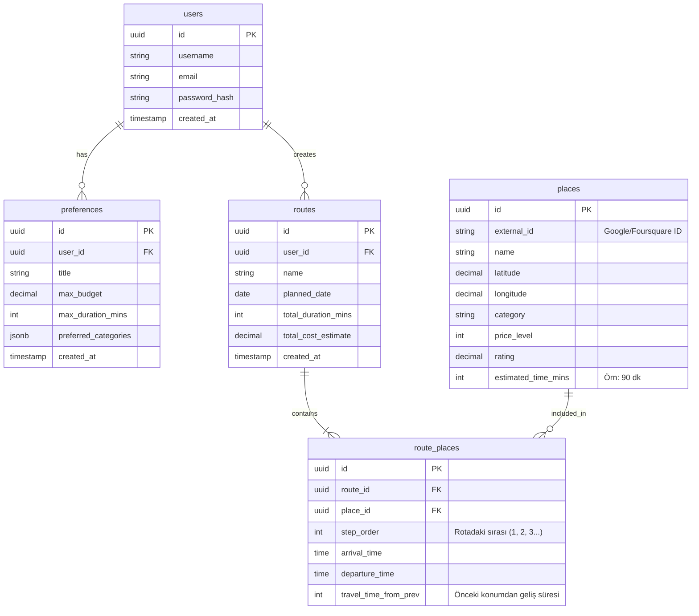

# TrackMate - PostgreSQL Veritabanı Şeması

Bu belge, TrackMate platformu için Kullanıcılar, Rotalar, Tercihler ve Mekanlar arasındaki ilişkiyi kuran temel veritabanı tasarımını içermektedir.

## Varlık İlişki (ER) Diyagramı

Aşağıdaki diyagramda tablolar arasındaki bire-çok ve çoka-çok ilişkiler özetlenmiştir.

